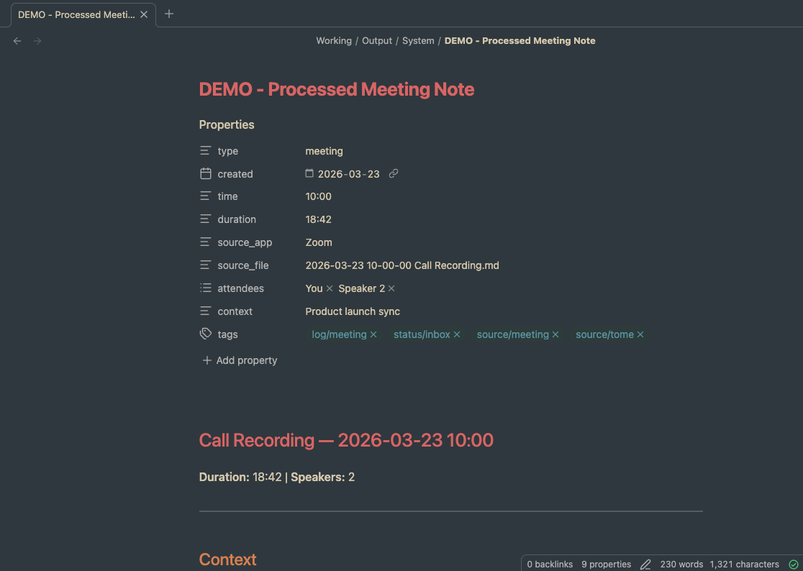
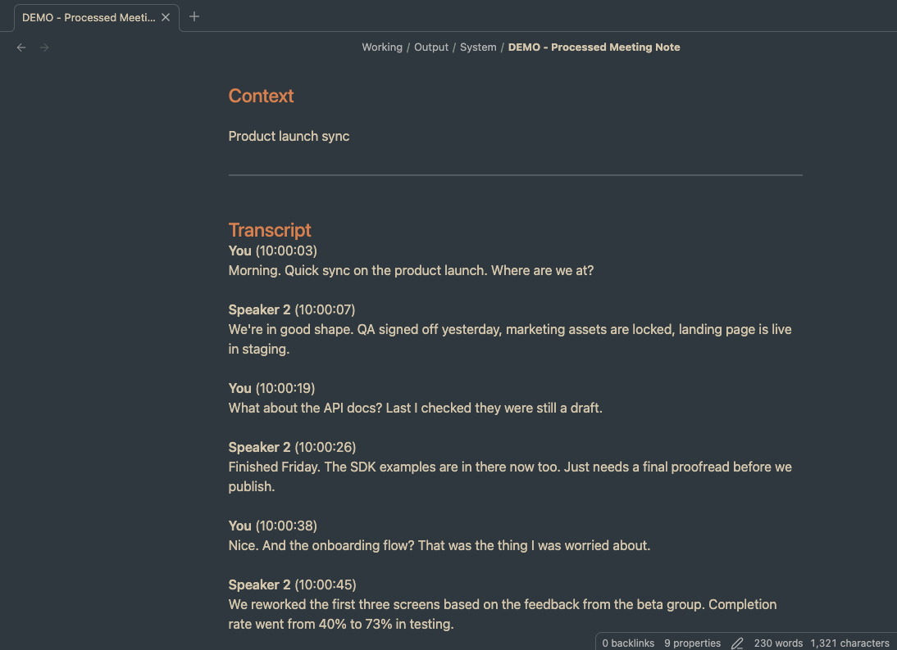

<h1 align="center">Tome</h1>

<p align="center">
  <strong>Local meeting capture → Obsidian vault → AI agent pipeline. No cloud. No API keys. Your data.</strong>
</p>

<p align="center">
  <a href="https://github.com/dloomis/Tome/releases/latest"></a>
  <a href="https://github.com/dloomis/Tome/releases/latest"></a>
  
  
  
  
</p>

---

Tome is a macOS app that captures meetings and voice memos, transcribes them locally with your choice of on-device model — Parakeet-TDT v3 (via FluidAudio, the default) or Whisper Large v3 Turbo (via WhisperKit) — and drops structured `.md` files straight into your Obsidian vault. Everything runs on-device. Nothing phones home. Pair it with [WhisperCal](https://github.com/dloomis/WhisperCal), an Obsidian plugin that drives Tome straight from your calendar — one-click meeting notes, recording via Tome's local API, and an LLM pipeline for speaker tagging and summaries ([details below](#the-obsidian-side-whispercal)).

> **Origins:** Tome began as a fork of an open-source app by [Jason Craik](https://github.com/Gremble-io) (itself built on [OpenGranola](https://github.com/yazinsai/OpenGranola)). That project has since moved in a different direction under a new name ([Detto](https://github.com/Gremble-io/Tome)), so Tome is now an independent project — designed, built, and maintained here — and stays MIT-licensed. Full [credits](#credits) below.

<p align="center">
  
  
</p>

## Install (macOS)

> ### [⬇️ Download the latest Tome.dmg](https://github.com/dloomis/Tome/releases/latest/download/Tome.dmg)
> Apple Silicon Mac · macOS 26+ · [all releases](https://github.com/dloomis/Tome/releases/latest)

1. Open the downloaded **`Tome.dmg`** and drag **Tome** into your **Applications** folder.
2. Open **Applications** and double-click **Tome**. **The first launch shows a warning — this is expected.** Tome is free and open-source (not paid-Apple-Developer signed), so macOS says:
   > *“Tome” can’t be opened because Apple cannot check it for malicious software.*
   >
   > Click **Done** — do **not** click “Move to Trash.”
3. Open **System Settings → Privacy & Security**, scroll to the bottom, and click **Open Anyway** next to the message about Tome. Confirm with Touch ID or your password.

That's a **one-time** approval. Tome launches normally every time afterward and keeps itself up to date automatically (Check for Updates is built in).

<sub>Prefer Terminal? `xattr -dr com.apple.quarantine /Applications/Tome.app` clears the flag and skips the prompt. Want to build from source instead? See [Build](#build).</sub>

## Background

Tome exists for one workflow: capture → vault → agent. If you're on calls all day and don't take notes, you want something that listens, transcribes, and drops structured markdown into your Obsidian vault where an agent layer can do the rest — pull action items, update client files, connect the dots. Otter, Granola, and Fireflies all lock your data in their cloud, none of them output plain markdown, and none of them are built to feed an agent pipeline.

That's the workflow Tome is built for. It started from an open-source foundation (see [credits](#credits)) and I've taken it well beyond — speaker diarization, crash-safe capture, a local API so other tools can drive it, opt-in audio retention, and more. The [capabilities](#capabilities) below show how far it's come; the [roadmap](https://github.com/dloomis/Tome/blob/main/ROADMAP.md) shows where it's headed.

## Why Tome?

- **Plain markdown out.** YAML frontmatter, tags, timestamps. Your vault already knows what to do with it. No proprietary export, no copy-paste, no middleman.
- **Built for the agent pipeline.** Tome is just the capture layer. You talk, it transcribes, your agent picks up the `.md` and does whatever you've wired it to do.
- **Runs on your machine.** Parakeet-TDT v3 or Whisper Large v3 Turbo on Apple Silicon. No API keys, no accounts, no subscriptions, no data leaving the building.

```
speak → capture → vault → agent → knowledge base
```

Tome does the first three. Your agent does the rest — or install [WhisperCal](https://github.com/dloomis/WhisperCal) and get the whole chain inside Obsidian.

## Features

- **Local transcription** on Apple Silicon, nothing hits the network. Pick your model in Settings ▸ Transcription: **Parakeet-TDT v3** ([FluidAudio](https://github.com/FluidInference/FluidAudio), default, fastest) or **Whisper Large v3 Turbo** ([WhisperKit](https://github.com/argmaxinc/WhisperKit), higher accuracy, larger download, fetched lazily the first time you select it).
- **Call Capture** grabs mic + system audio. Detects which conferencing app you're in (Teams, Zoom, Slack, etc.) and filters audio to just that app. Your Spotify and notification sounds stay out of the transcript.
- **Meeting autodetection.** Before you record, Tome spots an active Teams or Google Meet meeting by reading on-screen window titles — over the Screen Recording permission it already holds, with no new prompt and no network — and offers the meeting's name as a one-tap title for the recording. It's a dismissible suggestion, on by default, with a global off-switch in Settings. See [`docs/meeting-detection.md`](docs/meeting-detection.md).
- **Voice Memo** is mic only — for quick thoughts and verbal notes, but also **in-person meetings**: when more than one person is talking, post-session diarization splits the single mic stream into Speaker 1, Speaker 2, … just like a call. A solo memo stays one "You" block. Saves to a separate folder so it doesn't clutter your meeting transcripts.
- **Speaker diarization** runs after the session ends. For a call, pyannote splits the remote audio into Speaker 2, Speaker 3, …; for an in-person voice memo it splits the mic itself into Speaker 1, Speaker 2, …. Not perfect, but way better than one wall of unattributed text.
- **Speaker voiceprints (opt-in).** Settings > Output can export a per-speaker voice embedding (`.voiceprints.json`) next to each diarized transcript — call or in-person — so downstream tools ([WhisperCal](https://github.com/dloomis/WhisperCal)) recognize returning speakers acoustically and tag your regulars automatically — no cloud. Biometric data; off by default, stays on your machine. See [`docs/voiceprints.md`](docs/voiceprints.md).
- **Vault-native output** writes `.md` with frontmatter: `type`, `created`, `attendees`, `tags`, `source_app`. Lands in your vault ready to process.
- **Privacy.** Hidden from screen sharing by default. Audio is discarded after transcription — opt in to recording retention if you want to keep the audio file.
- **Timestamped lines.** Every transcript line is tagged with its start offset in seconds from the start of the recording (e.g. `(3.120)`). Drops straight into an [Obsidian Media Extended](https://github.com/aidenlx/media-extended) `#t=` link, so a line can replay the exact moment of audio it came from.
- **Optional recording retention.** Off by default. When enabled (Settings > Output), each session's combined audio — your mic plus the other side — is exported as a single `.m4a` (~25 MB/hour) to a folder you choose. Leave it off and nothing but text is kept.
- **Silence detection that asks first.** After a configurable stretch of dead air (default 120s, slider in Settings, 0 disables), Tome prompts you — in-app and via a notification with Stop/Keep buttons — instead of cutting the recording. Nothing stops without your confirmation, and the prompt dismisses itself if audio resumes.
- **Stop-recording confirmation.** The main Stop button (and its ⌘. shortcut) asks "Are you sure?" before tearing a session down, with Cancel as the default — so a stray click mid-meeting doesn't end the recording and kick off finalization. Capture keeps running while the dialog is up; scripted stops via the API are unaffected.
- **Menu bar status.** The menu bar book icon fills red and pulses while a session is recording, and pulses monochrome while a finished session is still being diarized in the background.
- **Configurable filenames.** Settings > Output exposes the date format and per-session-type labels so files land as `2026-05-20 14-30-00 Call Recording.md` or whatever pattern you prefer.
- **Crash-safe recordings.** WAVs are written with a self-healing header and stored under `~/Library/Application Support/Tome/sessions/` — a crash mid-meeting leaves a readable file. On next launch, Tome detects orphaned sessions and offers one-click recovery (diarization + transcript rebuild) or a manual `File > Recover from WAV…` (Cmd+Opt+R) for legacy WAVs.

## How It Works

```
┌─────────────┐     ┌──────────────────┐     ┌───────────────┐
│  Microphone  │────▶│                  │     │               │
└─────────────┘     │  Tome            │     │  Obsidian     │
                    │  ┌────────────┐  │────▶│  Vault        │
┌─────────────┐     │  │ On-device  │  │     │  (.md files)  │
│  System      │────▶│  │ ASR model  │  │     │               │
│  Audio       │     │  └────────────┘  │     └───────┬───────┘
└─────────────┘     └──────────────────┘             │
                                                     ▼
                                              ┌──────────────┐
                                              │  AI Agent    │
                                              │  Layer       │
                                              │  (notes,     │
                                              │   actions,   │
                                              │   updates)   │
                                              └──────────────┘
```

1. **Capture** picks up mic audio + system audio from a specific conferencing app via ScreenCaptureKit.
2. **Transcribe** runs VAD to detect speech segments, then your selected on-device model (Parakeet-TDT v3 or Whisper Large v3 Turbo) transcribes locally.
3. **Diarize** splits the system audio into individual speakers after the session ends.
4. **Write** drops structured `.md` with YAML frontmatter into your vault folder.
5. **Agent picks up** whatever you've got downstream processes the transcript — [WhisperCal](https://github.com/dloomis/WhisperCal) is the purpose-built option (see [The Obsidian Side](#the-obsidian-side-whispercal)).

## Output

<p align="center">
  
</p>

<p align="center">
  
</p>

```markdown
---
type: meeting
created: "2026-03-23"
time: "10:00"
duration: "18:42"
source_app: "Zoom"
recording: "[[2026-03-23 Call Recording.m4a]]"
session_guid: "74672674-af3f-4f37-97b9-bf6648a0b7f7"
attendees: ["You", "Speaker 2"]
tags:
  - log/meeting
  - status/inbox
  - source/tome
---

# Call Recording — 2026-03-23 10:00

**You** (3.120)
Morning. Quick sync on the product launch. Where are we at?

**Speaker 2** (7.480)
We're in good shape. QA signed off yesterday, marketing assets
are locked, landing page is live in staging.
```

Voice memos use `type: fleeting` with a single speaker. Same structure, same frontmatter.

Each line is tagged with its start offset in seconds (millisecond precision) from the
beginning of the recording. The value drops straight into an [Obsidian Media Extended](https://github.com/aidenlx/media-extended)
`#t=` fragment — e.g. `[[recording.m4a#t=3.120]]` — so a transcript line can jump the
audio to the exact moment it was spoken.

The `recording:` frontmatter property is written only when recording retention is on. It's
an Obsidian wikilink (quoted so the `[[…]]` parses as a YAML scalar) to the session's
`.m4a`, so Obsidian cleanly links the transcript and its audio.

The `session_guid:` property is a stable correlation key stamped into every note at capture
start (so a crash-orphaned transcript already carries it) and preserved through finalization
and rename. A driving tool that started the recording — [WhisperCal](https://github.com/dloomis/WhisperCal)
via the API, say — uses it to tie the finished transcript, its voiceprint sidecar, and its
own meeting note back to the exact session, even when several run back-to-back.

## The Obsidian Side: WhisperCal

Tome writes plain `.md` files — any downstream tool can pick them up. But if Obsidian is
your workspace, [WhisperCal](https://github.com/dloomis/WhisperCal) (same author) is the
other half of the workflow: an Obsidian plugin built around Tome's local Recording API
that closes the loop from calendar event to finished meeting note.

1. **Calendar in the sidebar** — browse your Microsoft 365 or Google Calendar day by day inside Obsidian.
2. **One-click meeting note** — templated, frontmatter pre-filled, attendees wiki-linked against your People folder.
3. **Record from the note** — WhisperCal calls Tome's localhost API with the meeting subject and attendees, so the transcript lands with the right filename and a seeded `## Context` block, then polls status until transcription completes.
4. **Transcript linked back** — the transcript and meeting note cross-link via frontmatter. Recordings that never got linked to a note surface in a collapsible "Unlinked recordings" section for cleanup, and back-to-back calls can be merged into one note (speaker labels renumbered, durations summed, originals archived).
5. **LLM pipeline** — speaker tagging turns `Speaker 2` into real names using per-speaker excerpts, summarization extracts decisions and action items, and a research stage pulls context from your own vault. Bring your own model: it works with any CLI that reads a prompt on stdin (Claude CLI is the tested path).

Tome stays fully useful standalone — WhisperCal is what turns the vault drop into an
end-to-end meeting workflow.

## Build

If you'd rather compile it yourself:

**Requirements:** Apple Silicon Mac, macOS 26+, Xcode 26.3+

```bash
git clone https://github.com/dloomis/Tome.git
cd Tome
./scripts/build_swift_app.sh
```

Builds and installs to `/Applications`. First launch downloads the Parakeet ASR model (~600MB, cached after that).

**Dev build:**

```bash
cd Tome
swift build
```

## Permissions

| Permission | When | Why |
|---|---|---|
| **Microphone** | All modes | Captures your voice |
| **Screen Recording** | Call Capture only | ScreenCaptureKit needs this for system audio from conferencing apps |

macOS re-prompts for Screen Recording permission roughly monthly. That's an OS thing, not Tome.

## Architecture

```
Tome/Sources/Tome/
├── App/
│   ├── TomeApp.swift               # App entry point
│   └── AppUpdaterController.swift  # Sparkle update controller
├── Audio/
│   ├── SystemAudioCapture.swift    # ScreenCaptureKit + per-app filtering
│   └── MicCapture.swift            # AVAudioEngine mic input
├── Models/
│   ├── Models.swift                # Domain types (Utterance, Speaker, etc.)
│   └── TranscriptStore.swift       # Observable transcript state
├── Transcription/
│   ├── TranscriptionEngine.swift   # Dual-stream capture + diarization
│   ├── StreamingTranscriber.swift  # VAD + Parakeet ASR pipeline
│   └── SegmentReTranscriber.swift  # Per-speaker re-transcription after diarization
├── API/
│   ├── APIServer.swift             # Local HTTP server for WhisperCal integration
│   └── APIModels.swift             # Request/response types and OpenAPI spec
├── Storage/
│   ├── TranscriptLogger.swift      # .md output with YAML frontmatter
│   └── SessionStore.swift          # Session metadata
├── Recovery/
│   ├── Recovery.swift              # Manual + automatic orphan recovery pipeline
│   ├── WAVStreamWriter.swift       # Crash-resilient WAV writer (self-healing header)
│   ├── SessionSidecar.swift        # Per-session {sessionId}.session.json metadata
│   └── OrphanScanner.swift         # Launch-time scan + recovery prompt
├── Settings/
│   └── AppSettings.swift
└── Views/
    ├── ContentView.swift
    ├── ControlBar.swift
    ├── TranscriptView.swift
    ├── SettingsView.swift
    ├── OnboardingView.swift
    └── CheckForUpdatesView.swift
```

## Privacy

- Transcription runs entirely on-device. No audio is ever sent anywhere.
- No network calls. No analytics. No telemetry.
- Audio is not saved by default — only text transcripts. Optional recording retention (off by default, Settings > Output) keeps a combined `.m4a` in a folder you choose; otherwise the working audio is deleted once post-processing finishes.
- The app window is hidden from screen sharing by default.
- Transcripts are saved as plain `.md` files to a folder you choose.

## Known Limitations

- **Apple Silicon only.** Parakeet and FluidAudio need Metal / ANE. No Intel.
- **macOS 26+ only.**
- **Screen Recording re-prompts monthly.** OS limitation.
- **Diarization is imperfect.** Works well with headset mics. Laptop speakers with crosstalk will give you worse speaker separation.
- **No live speaker labels.** Diarization runs after the session ends. During capture, remote audio (calls) or the mic (in-person memos) shows as a single stream.
- **In-person separation depends on the room.** One laptop mic for a whole table works, but far/overlapping voices diarize worse than a per-person or headset setup.

## Capabilities

Tome has grown well beyond its open-source starting point. Here's what's built in:

### Diarization & transcription

- **SpeakerKit diarization (pyannote v4)** — replaces upstream's FluidAudio offline diarizer with [SpeakerKit](https://github.com/argmaxinc/WhisperKit). After a session ends, the diarized stream — system audio for calls, or the mic itself for mic-only in-person sessions — is re-processed for speaker segmentation and each segment is re-transcribed with per-speaker labels. Tuned in Settings ▸ Transcription: **Cluster Distance Threshold** (how readily two voices are treated as one speaker; lower = more speakers), **Number of Speakers** (fixed count, or 0 for automatic), and **Same-Speaker Merge Gap** (below).
- **Same-Speaker Merge Gap** — before re-transcription, a speaker's consecutive diarized segments separated by no more than this pause are merged into one block (and one re-transcription span, which also gives Parakeet more context). Higher values collapse sentence-by-sentence fragments into readable paragraphs; a different speaker's turn always breaks the run, so it never merges two people. Settings ▸ Transcription slider, 0–3s in 0.25s steps, default 1.5s.
- **Background post-session processing** — diarization + frontmatter finalization run on a serial background queue (`PostProcessingQueue`) so a new recording can start immediately after Stop. The menu bar icon pulses while finalization is in flight.
- **Keep transcribing while the display sleeps** — capture and ASR are no longer interrupted by display sleep.
- **Dynamic ASR language hint** — `AppSettings.transcriptionLanguage` flows through to the ASR coordinator at session start and on the fly; UI exposure ships in the next release.
- **Fresh TDT decoder state per transcribe call** — eliminates cross-utterance state bleed that produced empty/duplicated outputs on FluidAudio 0.14.
- **`<unk>` token sanitization** — Parakeet v3's SentencePiece vocab has no token for a range of printable symbols (`& @ # ( ) + …`), so the decoder emits a literal `<unk>` where it hears one (field-observed as `P<unk>L` for "P&L"). `ASRTextSanitizer`, applied centrally in `ASRCoordinator` so live and batch paths both pass through it, renders `<unk>` tightly wrapped by letters/digits as `&` (the dominant case — P&L, R&D, AT&T, S&P) and drops the rest with whitespace re-collapsed, so an unrecoverable symbol degrades to a clean omission instead of leaking markup into the vault.
- **Tracks current FluidAudio** — pinned to 0.15.1+, picking up ~8% faster Parakeet v3 transcription (GPU encoder placement, WER-neutral), the French accent-drift token blocklist, and Greek script support.

### Reliability & durability

- **fsync on every disk write** — `TranscriptLogger` and `SessionStore` call `fileHandle.synchronize()` after every flush so the last 1–3 utterances survive kernel panic, SIGKILL, or sudden power loss (not just a process crash).
- **Terminate flush** — `applicationShouldTerminate` flushes both the live markdown writer and the JSONL crash-recovery file before the OS reaps the process, with a 2s hard cap.
- **Filename collision handling** — `TranscriptFinalizer` appends `-1`, `-2`, … instead of clobbering an existing file when context-based renames collide; the save banner reflects the resolved name.
- **Visible failures instead of silent drops** — mic device-set OSStatus errors, system-audio WAV write errors (counted through to the post-processing job as a warning), short-segment drops, vault-disappeared state, and context-update reopen failures all surface to a `lastError` polled by the UI.
- **Strict utterance ordering** — markdown and JSONL writes flow through a single-consumer `AsyncStream` instead of racing per-utterance Tasks.
- **YAML-safe context** — frontmatter `context:` is fully escaped (newlines, tabs, quotes) so multi-line context strings can't break parsers.
- **`[transcription failed]` placeholders** — re-transcription errors leave a visible hole in the final transcript instead of silently dropping the segment.
- **Crash-resilient WAV writer** — `WAVStreamWriter` replaces `AVAudioFile` for system-audio capture. The RIFF + `data` chunk sizes are refreshed in place after every buffer write, with `synchronize()` throttled to ~1 Hz on the SCStream callback queue. A crash, force-quit, or power loss leaves a readable WAV up to ~1 second before the failure, instead of a 0-byte-data header (the previous failure mode silently zeroed out hours of audio on disk).
- **Stable WAV storage** — system-audio WAVs live in `~/Library/Application Support/Tome/sessions/{sessionId}.wav` alongside the JSONL crash files. Out of `$TMPDIR`'s purge path. The success path of `PostProcessingJob` deletes the WAV, so anything left in `sessions/` is by definition an orphan.
- **Per-session sidecar** — `SessionSidecar` writes `{sessionId}.session.json` next to each WAV at capture start, carrying `sessionId`, `sessionGuid`, `transcriptPath`, `startedAt`, `sourceApp`, `sessionType`, and audio format. Orphan recovery becomes deterministic (the WAV unambiguously knows which transcript it belongs to) rather than heuristic time-matching, and reuses the GUID already stamped in the note's frontmatter so recovered artifacts keep the same identity. Schema-versioned, so older sidecars without the GUID still decode.
- **Launch-time orphan recovery** — on app boot, `OrphanScanner` enumerates `sessions/*.wav` and pairs each with its sidecar. If any are found, a consolidated alert surfaces with Recover All / Discard All / Decide Later. "Recover All" iterates through the diarization → re-transcription → body-rebuild pipeline and shows a summary; failures stay on disk for retry via the manual command.
- **Manual recovery command** — `File > Recover from WAV…` (Cmd+Opt+R) pairs an arbitrary WAV and transcript through two open panels. Useful for legacy WAVs without a sidecar (e.g. `$TMPDIR` files from before the resilience work).

### API & integration

- **Local HTTP API server** — `APIServer` on `127.0.0.1` for programmatic session control. Endpoints for starting/stopping recordings, polling session lifecycle, and retrieving transcripts. Accepts an optional `suggestedFilename` and `MeetingContext` so callers can control output naming and seed the `## Context` body. Port is written to `~/Library/Application Support/Tome/api-port` on launch; an OpenAPI 3.1 spec is served at `GET /` for discoverability. State machine: `idle → recording → transcribing → complete → idle`. Used by [WhisperCal](https://github.com/dloomis/WhisperCal) but any local client can call it.
- **`GET /status` identifies the live recording** — while a session is recording or transcribing, the status payload carries a `recording` object with the meeting `subject`, `suggestedFilename`, and `sessionGuid`, so a client can show *which* meeting is in progress before offering to start another. Purely additive: an idle response stays `{"state":"idle"}` and older clients ignore the extra fields.
- **Session GUID correlation** — every session carries a GUID: the API caller supplies one in `POST /start` (any safe string ≤ 64 chars, canonically a UUIDv4) and Tome echoes it alongside the internal `sessionId`; menu-bar and voice-memo sessions get one minted automatically. The GUID is stamped into the transcript frontmatter (`session_guid:`) and the voiceprint sidecar, and a new `GET /sessions/by-guid/{guid}/status` reports that exact session's state — `recording → transcribing → complete` (with the *final* transcript filename and path, after any collision suffix or rename) or `failed` (with the reason). The server retains every live session plus the 20 most recently finished, so a caller can reliably follow one recording to its saved file even while later sessions record and finalize concurrently — no more matching by filename guesswork. Fully additive; a client that reads only the legacy `{"ok":true}` is unaffected. See [`SESSION_GUID_DESIGN.md`](SESSION_GUID_DESIGN.md).
- **Settings > API tab** — shows the fixed port, a copy-to-clipboard button for the base URL, and the full endpoint reference.
- **API race fix** — duplicate session-start requests are rejected instead of being honored in parallel.

### UI & customization

- **Tabbed Settings window** — five panes (General · Audio · Transcription · Output · API) with SF Symbol icons replace the single scrolling Form. Per-tab state means device enumeration and the API port read only happen when you visit those tabs.
- **Silence stop confirmation** — silence never ends a session on its own. After the configurable timeout (Settings > Audio slider, 0–600s in 30s steps, 0 disables, default 120s), recording continues while Tome asks: a Stop & Save / Keep Recording prompt in the control bar plus an actionable notification with the same buttons for when the window is hidden behind the meeting app. The prompt auto-dismisses if audio resumes, and Keep Recording re-arms it after another full silence window.
- **Stop-recording confirmation** — the main Stop button (and ⌘.) presents a standard alert before ending a session, with **Cancel as the default** (Return cancels) so an accidental click mid-meeting can't irreversibly stop the recording and start finalization. Capture, transcription, and timers keep running behind the dialog. A small `@Observable` `StopConfirmationModel` owns the lifecycle (unit-tested); the dialog withdraws itself if the session ends by any other path (capture error, API stop, notification stop). Deliberately scoped to the main button only — the silence prompt is already a confirmation and `POST /stop` stays scriptable.
- **Live recording state in the menu bar** — the book icon fills red and pulses for the duration of a session (with a "Recording…" line in the menu), taking priority over the monochrome pulse used for background finalization.
- **Meeting autodetection (Teams / Google Meet)** — while idle, Tome reads on-screen window titles via `SCShareableContent` (the Screen Recording permission it already holds — enumerating windows starts no `SCStream`, so there's no recording indicator, no new prompt, and no network) and surfaces the active meeting's name as a dismissible chip above Call Capture. Accept it and the session is named for the meeting (`<date> <subject>.md`); ✕ falls back to the label and a *different* meeting re-arms the chip. On by default; global off-switch in Settings ▸ Output. Per-app title extraction is a set of pure, individually tunable heuristics — Zoom and apps that expose no topic show no chip rather than a noisy false positive. Rides the same naming pipeline as API-driven meetings, so an API `meetingContext`/`suggestedFilename` always outranks an autodetected name. See [`docs/meeting-detection.md`](docs/meeting-detection.md).
- **Configurable filename template** — Settings > Output exposes the `DateFormatter` pattern plus per-session-type labels ("Call Recording", "Voice Memo" by default). Rename to "Scheduled Meetings", "Quick Notes", etc., or leave a label blank for date-only filenames. A shared sanitizer scrubs filesystem-hostile characters (`/ \ : ? * < > | "`, control chars, leading dots) so user-entered formats are always safe to commit to disk. The chosen format is snapshotted at session start so a mid-recording settings change doesn't shift the prefix on an in-flight session's post-processing rename.
- **Optional recording retention** — `Settings > Output > Recordings` toggle (off by default) exports each session's combined audio as a single `.m4a`. `RecordingMixer` pads each track by `firstSample − sessionStart` so the mic and system streams align to the same timeline as the transcript, then `PostProcessingJob` writes the file to the chosen folder (default `~/Documents/Tome/Recordings`) after diarization. With retention off, the working WAVs are deleted once post-processing finishes.
- **Per-line time offsets** — transcript lines are tagged with their start offset in seconds (millisecond precision) from the session start instead of wall-clock time. `StreamingTranscriber` derives the offset from a 16 kHz audio sample clock, so each line marks where its speech *begins* rather than when ASR finalized it. The decimal-seconds value (e.g. `(3.120)`) drops directly into an [Obsidian Media Extended](https://github.com/aidenlx/media-extended) `#t=` fragment — `[[recording.m4a#t=3.120]]` — for click-to-play against the retained recording.
- **File > Save Transcript (Cmd+S)** — manually save the current transcript at any time during or after a session via `NSSavePanel`.
- **View > Logs** — collects Tome's unified-logging (`os.Logger`) output from the last 2 hours via `log show` into a temp file and opens it for quick diagnostic inspection. Replaces the old world-readable `/tmp/tome.log` writer; entries are metadata-only (counts, formats, filenames, errors), never transcript text.
- **Window scene (single instance)** — replaces `WindowGroup` so macOS 26 stops adding the "+" duplicate-instance pill to the toolbar.
- **Drop full-screen / tab-bar menu entries** — `NSWindow.allowsAutomaticWindowTabbing = false` and window opt-out of full-screen, so the View menu stays clean.

### Other

- **Atomic file writes** with `replaceItemAt` for the markdown rewrite paths (frontmatter, context updates, rebuild-from-diarization).
- **Empty-transcript guard** for short sessions that previously got stuck on "Identifying speakers…".
- **Code quality** — session ID mismatch fixes in API responses, dead-code removal, and assorted bug fixes.

## Credits

Tome began as a fork of an open-source project by [Jason Craik](https://github.com/Gremble-io), which itself built on [OpenGranola](https://github.com/yazinsai/OpenGranola) — sincere thanks to both for the foundation. That project has since become a separate product, [Detto](https://github.com/Gremble-io/Tome); Tome has grown into its own standalone app, maintained here by [@dloomis](https://github.com/dloomis). Released under the [MIT license](LICENSE), which preserves the original copyright notices.

## License

[MIT](LICENSE)
